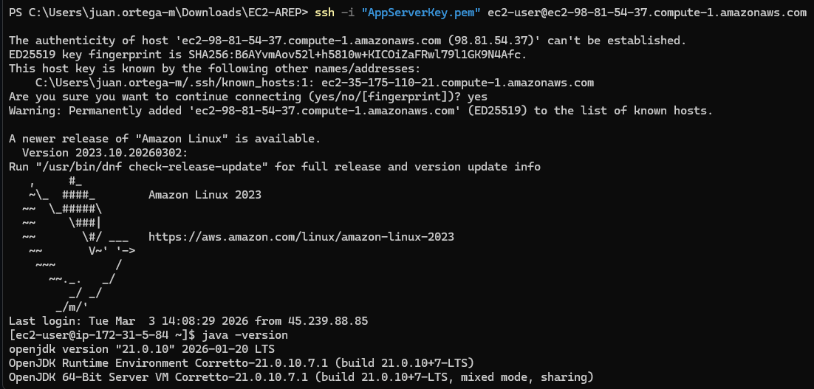
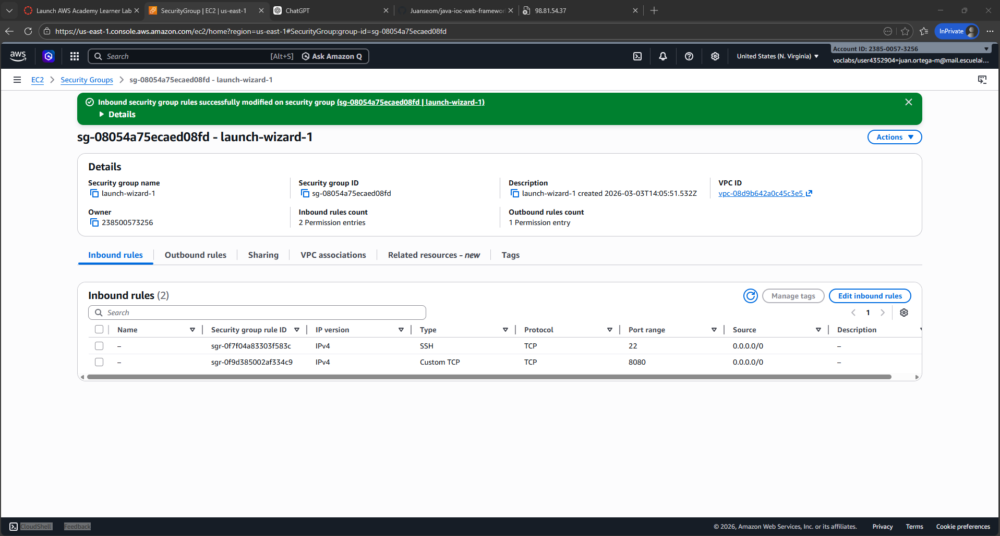
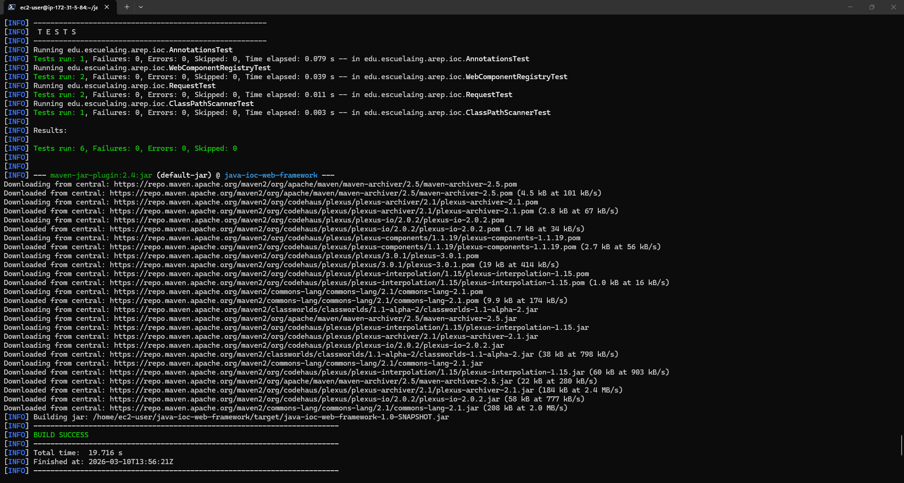
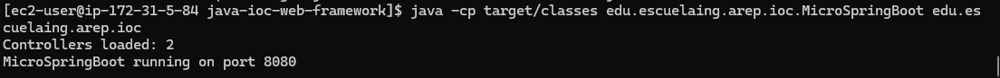
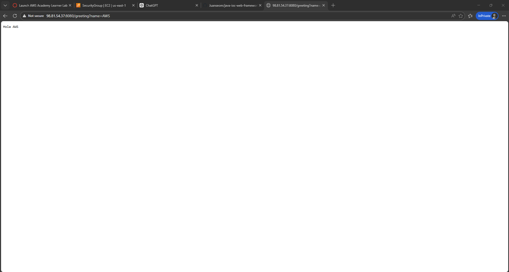

# Java IoC Web Framework

A minimal Java web framework built for the Application Server Architectures lab.
This project combines a basic HTTP server with an IoC mechanism based on reflection and custom annotations.

---

## Author

Juan Sebastian Ortega Muñoz

---

## Table of contents

1. [Project objective](#project-objective)
2. [What problem it solves](#what-problem-it-solves)
3. [General architecture](#general-architecture)
4. [Project structure](#project-structure)
5. [Main components](#main-components)
6. [Framework annotations](#framework-annotations)
7. [Full request lifecycle](#full-request-lifecycle)
8. [Requirements](#requirements)
9. [Installation and execution](#installation-and-execution)
10. [Test endpoints](#test-endpoints)
11. [Automated tests](#automated-tests)
12. [AWS deployment (evidence)](#aws-deployment-evidence)
13. [Evaluation checklist](#evaluation-checklist)

---

## Project objective

Build a functional IoC framework prototype in Java that can:

- Start a basic Apache-style web server (non-concurrent request handling).
- Serve static files (`.html` and `.png`).
- Load POJO components using reflection.
- Publish methods as REST services using annotations (`@GetMapping`).
- Resolve query parameters using `@RequestParam`.

---

## What problem it solves

Without a framework, for every endpoint you would need to:

- Create server routes manually.
- Parse query params manually.
- Instantiate classes explicitly.

With this project, the framework does that automatically:

- Scans classes in the base package.
- Detects controllers with `@RestController`.
- Registers methods with `@GetMapping`.
- Injects query param values into parameters annotated with `@RequestParam`.

---

## General architecture

```text
Client (Browser / curl)
        |
        v
HttpServer (Socket on port 8080)
        |
        +--> Static route? --------> yes -----> Load resource from /webroot
        |
        +--> Component route ------> Look up in WebComponentRegistry
                                     |
                                     v
                           RouteDefinition (instance + method)
                                     |
                                     v
                       Reflection invocation (Method.invoke)
                                     |
                                     v
                            HTTP response (String)
```

---

## Project structure

```text
java-ioc-web-framework/
|-- pom.xml
|-- README.md
|-- src/
|   |-- main/
|   |   |-- java/
|   |   |   |-- edu/
|   |   |   |   |-- escuelaing/
|   |   |   |   |   |-- arep/
|   |   |   |   |   |   |-- ioc/
|   |   |   |   |   |   |   |-- MicroSpringBoot.java
|   |   |   |   |   |   |   |-- HttpServer.java
|   |   |   |   |   |   |   |-- ClassPathScanner.java
|   |   |   |   |   |   |   |-- WebComponentRegistry.java
|   |   |   |   |   |   |   |-- RestController.java
|   |   |   |   |   |   |   |-- GetMapping.java
|   |   |   |   |   |   |   |-- RequestParam.java
|   |   |   |   |   |   |   |-- Request.java
|   |   |   |   |   |   |   |-- Response.java
|   |   |   |   |   |   |   |-- FirstWebService.java
|   |   |   |   |   |   |   `-- GreetingController.java
|   |   `-- resources/
|   |       `-- webroot/
|   |           `-- index.html
|   `-- test/
|       `-- java/
|           `-- edu/escuelaing/arep/ioc/
|               |-- RequestTest.java
|               |-- ClassPathScannerTest.java
|               |-- WebComponentRegistryTest.java
|               `-- AnnotationsTest.java
`-- .gitignore
```

---

## Main components

### `MicroSpringBoot.java`

- Entry point (`main`).
- Defines default base package: `edu.escuelaing.arep.ioc`.
- Calls `WebComponentRegistry.registerControllersInPackage(...)`.
- Starts `HttpServer.start()`.

### `HttpServer.java`

- Opens a socket on port `8080`.
- Processes incoming HTTP requests.
- Decides whether the route is static or component-based.
- If the route exists in the registry, invokes the method and responds.

### `WebComponentRegistry.java`

- Stores routes in memory (`Map<String, RouteDefinition>`).
- Each `RouteDefinition` contains:
  - Controller instance.
  - Associated Java method.
- Prevents duplicate routes (`@GetMapping` path conflicts).

### `ClassPathScanner.java`

- Scans compiled classes in the base package.
- Ignores inner classes (`$`).
- Returns class names to be loaded via reflection (`Class.forName`).

### `Request.java`

- Represents the HTTP request.
- Parses query string into a `Map<String, String>`.
- Lets you read values by key with `getValue(...)`.

---

## Framework annotations

### `@RestController`

Used on a class to mark it as a web component.

```java
@RestController
public class FirstWebService {
    @GetMapping("/")
    public String index() {
        return "Greetings from MicroSpringBoot!";
    }
}
```

### `@GetMapping("/route")`

Used on a method to expose it as a GET endpoint.

Current framework rules:

- The method must return `String`.
- The path must be unique across the system.

### `@RequestParam(value = "name", defaultValue = "World")`

Used in method parameters to read query params.

```java
@GetMapping("/greeting")
public String greeting(@RequestParam(value = "name", defaultValue = "World") String name) {
    return "Hola " + name;
}
```

Behavior:

- If `?name=Juan` is provided, it returns `Hola Juan`.
- If `name` is missing, it uses `World` as default value.

---

## Full request lifecycle

Example: `GET /greeting?name=Ana`

1. The client sends the request to port `8080`.
2. `HttpServer` reads the request line and splits route + query.
3. It looks for `/greeting` in `WebComponentRegistry`.
4. It finds the method `GreetingController.greeting(...)`.
5. It resolves `name` using `@RequestParam`.
6. It invokes the method via reflection.
7. It builds the HTTP response with body `Hola Ana`.
8. It returns the response to the client.

---

## Requirements

- Java 17 or higher
- Maven 3.9 or higher
- Git

---

## Installation and execution

### 1) Clone project

```bash
git clone <REPOSITORY_URL>
cd java-ioc-web-framework
```

### 2) Compile

```bash
mvn clean package
```

### 3) Run

```bash
java -cp target/classes edu.escuelaing.arep.ioc.MicroSpringBoot edu.escuelaing.arep.ioc
```

If you want to use the default package, you can also run without the second argument:

```bash
java -cp target/classes edu.escuelaing.arep.ioc.MicroSpringBoot
```

---

## Test endpoints

Once the server is running:

- `http://localhost:8080/`
  - Expected response: static content or root service message (depending on route handling order).
- `http://localhost:8080/greeting`
  - Expected response: `Hola World`
- `http://localhost:8080/greeting?name=Juan`
  - Expected response: `Hola Juan`

Quick checks with browser or `curl`:

```bash
curl "http://localhost:8080/greeting"
curl "http://localhost:8080/greeting?name=Juan"
```

---

## Automated tests

This project includes JUnit 5 tests in `src/test/java`.

### What each test validates

- `RequestTest`
  - Query param parsing.
  - Missing parameter handling.
- `ClassPathScannerTest`
  - Class discovery in base package.
- `WebComponentRegistryTest`
  - Controller and route registration.
  - Controller loading by class name.
- `AnnotationsTest`
  - Presence and correct configuration of `@GetMapping` and `@RequestParam`.

### Run tests

```bash
mvn test
```

---

## AWS deployment and evidence

The rubric asks for evidence of running the server on AWS. The simplest approach is EC2.

### 1) Create instance

- Suggested type: Amazon Linux `t2.micro`.
- Security Group:
  - `22` (SSH) from your IP.
  - `8080` (Custom TCP) from `0.0.0.0/0` for demo.

### 2) Connect via SSH

```bash
ssh -i <your-key.pem> Amazon@<EC2_PUBLIC_IP>
```

### 3) Install dependencies

```bash
sudo apt update
sudo apt install -y openjdk-17-jdk maven git
java -version
mvn -version
```

### 4) Clone and run app

```bash
git clone <REPOSITORY_URL>
cd java-ioc-web-framework
mvn clean package
java -cp target/classes edu.escuelaing.arep.ioc.MicroSpringBoot edu.escuelaing.arep.ioc
```

### 5) Validate from local browser

- `http://<EC2_PUBLIC_IP>:8080/`
- `http://<EC2_PUBLIC_IP>:8080/greeting?name=AWS`

### 6) Evidence

#### EC2 instance running



#### Security Group with port 8080



#### EC2 terminal with server running






#### Browser consuming endpoints



---
